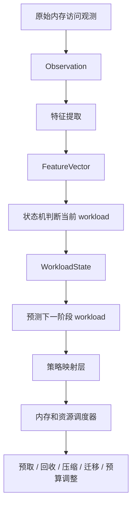

# Workload 预测指导调度说明

## 1. 文档目的

本文档说明 lzx-zr 生成的 workload 预测结果如何指导后续调度，以及当前原型已经实现和还没有实现的部分。

这里的“指导调度”是指：根据当前 workload 状态和预测的下一阶段状态，选择更合适的内存与资源管理策略。

当前 lzx-zr 是用户态原型，预测结果主要用于观测、分析和 shadow 验证，不会直接修改内核状态。

---

## 2. 总体流程



其中：

- `Observation`：原始观测数据
- `FeatureVector`：提取后的访问、复用、热点、工作集和压力特征
- `WorkloadState`：当前 workload 状态
- `Prediction`：预测的下一阶段状态、置信度和有效时间
- 策略映射层：把 workload 状态转换为调度策略
- 调度器：真正执行内存或资源调整

当前 lzx-zr 已实现前半部分，策略执行层仍然属于后续集成工作。

---

## 3. Workload 状态与调度策略

### 3.1 STABLE_HOT：稳定热点

#### 访问特征

- 热点区域比较稳定
- 页面重复访问较多
- 工作集不是快速膨胀状态
- 访问集中度较高

#### 可以指导的调度动作

- 提高热点页的保留优先级
- 减少对热点页的回收
- 优先把热点页放在访问速度更快的内存层
- 适当增加对应任务的内存预算
- 不需要进行激进预取，因为热点已经比较明确

#### 调度含义

预测为 `STABLE_HOT` 时，重点是“保护已有热点”，避免刚识别出的热点页被回收，造成下一轮缺页。

---

### 3.2 STREAMING：流式访问

#### 访问特征

- 访问顺序比较明显
- 页面通常只访问一次或很少重复访问
- 访问热点会随着数据流向前移动

#### 可以指导的调度动作

- 适度预取后续连续区域
- 降低已经访问过的旧页面的保留优先级
- 避免把大量流式数据长期放在内存中
- 采用较小的预取窗口，防止预取过量

#### 调度含义

预测为 `STREAMING` 时，重点是“提前准备后面的数据，同时及时释放前面的数据”。

---

### 3.3 BURST_EXPANSION：突发扩张

#### 访问特征

- 工作集快速变大
- 页面分配增加
- 缺页或访问压力可能快速上升

#### 可以指导的调度动作

- 提前准备空闲页
- 临时增加任务的内存预算
- 暂缓对该任务工作集的激进回收
- 降低后台任务的资源竞争优先级
- 对新增的热点区域优先建立保护或预取策略

#### 调度含义

预测为 `BURST_EXPANSION` 时，重点是“提前为即将扩大的工作集准备资源”，避免系统等到大量缺页发生后才被动处理。

---

### 3.4 MULTI_HOTSPOT：多热点

#### 访问特征

- 同时存在多个活跃访问区域
- 热点不是集中在单个区域
- 热点可能发生移动或轮换

#### 可以指导的调度动作

- 按多个热点区域分配资源
- 不要只保护一个热点
- 根据热点访问频率进行分级保护
- 对热点之间的迁移和回收设置公平额度

#### 调度含义

预测为 `MULTI_HOTSPOT` 时，调度器应该进行“分散保护”，避免资源全部集中到一个区域，导致其他活跃区域频繁缺页。

---

### 3.5 LOW_VALUE_COLD：低价值冷态

#### 访问特征

- 工作集很小或当前几乎没有访问
- 分配和压力指标较低
- 页面短时间内再次访问的可能性较小

#### 可以指导的调度动作

- 提高这部分页面的回收优先级
- 进行压缩或迁移
- 降低内存驻留预算
- 把空闲资源让给前台或热点任务

#### 调度含义

预测为 `LOW_VALUE_COLD` 时，重点是“释放低价值资源”，为其他更活跃的 workload 腾出空间。

---

### 3.6 RANDOM：随机访问

#### 访问特征

- 访问地址分散
- 空间局部性较低
- 顺序预取收益不明显

#### 可以指导的调度动作

- 谨慎使用预取
- 优先保证容量，而不是扩大预取窗口
- 依据实际命中率动态调整缓存策略
- 限制无效页面迁移和批量加载

#### 调度含义

预测为 `RANDOM` 时，不能简单套用流式访问策略，否则可能产生大量无效预取和额外内存压力。

---

### 3.7 UNKNOWN 或 MIXED：未知或混合状态

#### 访问特征

- 区域顺序缺失
- 特征之间无法形成稳定结论
- 多种行为同时存在
- 置信度不足

#### 可以指导的调度动作

- 使用 Native fallback
- 保持现有调度策略
- 继续采样，等待更多窗口数据
- 不执行激进预取、回收或迁移

#### 调度含义

`UNKNOWN` 和 `MIXED` 不应该直接触发强调度动作。预测不确定时，保守策略通常比错误的激进策略更安全。

---

## 4. Prediction 字段如何参与调度

预测器输出的 `Prediction` 主要包含以下信息：

### 4.1 next

表示预测的下一阶段 workload 状态，例如：

```text
next = BURST_EXPANSION
```

策略映射层根据这个字段选择调度策略。

### 4.2 probability_q15

表示预测置信度，使用 Q15 定点数保存。

可以按置信度设置不同动作强度：

| 置信度 | 建议动作 |
|---|---|
| 高 | 可以执行较积极的资源准备或保护 |
| 中 | 只执行小范围、可回退的调整 |
| 低 | 使用 Native fallback，继续观测 |

### 4.3 horizon_ms

表示预测覆盖的时间范围。当前原型默认大约预测未来 3 秒。

例如：

```text
horizon_ms = 3000
```

表示调度器可以把该预测理解为未来几秒内的趋势，而不是长期结论。

### 4.4 ttl_ms

表示预测结果的有效时间。当前原型默认约为 5 秒。

预测过期后必须重新采样，不能无限使用旧预测。

### 4.5 method

表示预测方法，例如：

- `rule_trend`：规则趋势预测
- `second_order_markov`：二阶 Markov 状态转移预测

调度器可以根据方法和置信度决定是否接受该预测。

---

## 5. 状态到策略的简单映射表

```text
STABLE_HOT       -> 保护稳定热点，减少热点回收
STREAMING        -> 适度预取，降低旧页优先级
BURST_EXPANSION  -> 提前准备内存，增加临时预算
MULTI_HOTSPOT    -> 同时保护多个热点区域
LOW_VALUE_COLD   -> 提高回收、压缩或迁移优先级
RANDOM           -> 限制激进预取，优先保证容量
UNKNOWN          -> 使用原生策略，继续观测
MIXED            -> 使用保守策略，避免强动作
```

这张表是策略设计的起点，不代表当前代码已经执行了这些动作。

---

## 6. 一个完整例子

假设系统连续观测到：

```text
当前状态：BURST_EXPANSION
预测状态：STABLE_HOT
预测置信度：较高
预测时间范围：3 秒
```

策略映射层可以给出如下建议：

1. 暂时保留新增的工作集页面
2. 对当前访问频率高的区域提高保护等级
3. 暂停对该任务进行激进回收
4. 预测进入稳定状态后，停止继续扩大内存预算
5. 后续根据新的观测决定是否释放多余资源

另一个例子：

```text
当前状态：RANDOM
预测状态：RANDOM
预测置信度：中等
```

此时不应该继续扩大顺序预取，而应当：

1. 限制预取窗口
2. 观察真实命中率
3. 优先保障工作集容量
4. 命中率下降时及时回退

---

## 7. 当前项目已经实现的部分

lzx-zr 当前已经能够完成：

- 读取 JSONL 观测数据
- 提取访问和内存压力特征
- 判断当前 workload 状态
- 预测下一阶段 workload
- 输出 prediction snapshot
- 输出 `parp_shadow_hint.json`
- 在 SHADOW 模式下进行审计和验证

当前项目还没有直接执行：

- 内核预取
- 页面回收
- 页面压缩
- 页面迁移
- swap 控制
- cgroup 内存预算修改
- 调度器参数修改
- APPLY 模式的真实内核动作

因此现在的预测结果更准确地说是“调度建议”或“策略输入”，还不是实际的调度命令。

---

## 8. 调度执行层需要的保护条件

预测结果不能直接等同于执行命令。正式接入调度器时，建议增加以下保护：

- 置信度低于阈值时使用 Native fallback
- 预测过期后重新采样
- 连续多个窗口预测一致后再执行强动作
- 限制单次预取、回收和迁移的页面数量
- 持续监控 PSI、缺页率和 refault 率
- 系统压力突然升高时立即回退
- `UNKNOWN` 和 `MIXED` 状态禁止激进动作
- 所有动作保留审计记录，便于比较预测前后效果

推荐的执行模式是：

```text
预测 -> 策略建议 -> 小范围执行 -> 监控结果 -> 接受或回退
```

而不是：

```text
预测 -> 直接执行大量内存操作
```

---

## 9. 与当前准确率测试的关系

场景准确率测试用于判断：

- 当前状态是否识别正确
- 下一状态是否预测正确
- 规则预测和 Markov 预测哪个更稳定

只有当准确率、置信度和回退机制达到要求后，预测结果才适合进一步接入真实调度执行器。

准确率报告位于：

- [scenario_accuracy_report.md](../test-reports/scenario_accuracy_report.md)
- [scenario_accuracy_report.json](../test-reports/scenario_accuracy_report.json)

需要注意：如果状态机或预测器刚刚调整过，应重新运行场景评估，不能直接把历史报告当作最新结果。

---

## 10. 总结

workload 预测对调度的核心作用是提前回答两个问题：

1. 接下来哪些页面或任务更值得保护？
2. 接下来哪些页面或任务可以回收、压缩或降低资源优先级？

最终形成的关系是：

```text
workload 识别：现在是什么行为
workload 预测：接下来可能是什么行为
策略映射：应该采用什么调度策略
执行器：真正修改哪些资源
```

当前 lzx-zr 已经完成“识别和预测”，并通过 shadow 输出为后续调度策略提供输入；真正的内核和资源调度执行需要在后续适配层中完成。
