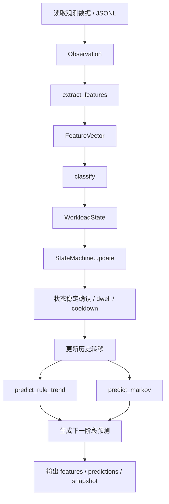

# 关键代码与预测流程说明

本文档聚焦说明这个 workload-aware 原型的核心代码结构、关键数据结构以及预测流程，便于快速理解项目如何从原始观测数据转成工作负载状态，再预测下一阶段的访问行为。

---

## 1. 项目总体定位

这个目录是一个用户态原型，不直接接入 Linux 内核，也不依赖真实内核监控接口。它的目标是：

- 接收一个窗口期内的访问观测数据
- 从原始 region/cgroup 观测中提取特征
- 判定当前工作负载偏向哪种状态
- 记录状态转移历史
- 预测下一阶段的工作负载趋势
- 输出特征、快照、兼容提示等结果

从实现上看，它是一个“观测 -> 特征 -> 判定 -> 预测 -> 输出”的闭环流程。

---

## 2. 关键代码模块

### 2.1 数据入口：tools/run_workload_aware.py

这是项目的主执行入口，负责把 JSONL/文件输入转成程序可消费的观察结果，并串联整个流程。

它一般负责以下工作：

- 读取观测样本
- 对每条 observation 调用特征提取逻辑
- 获取当前 workload 状态
- 调用 predictor 生成下一阶段预测
- 生成 snapshot 和兼容提示
- 把结果落盘到 outputs 目录

这个脚本本质上是“流程编排器”，它不实现具体判断逻辑，而是把各个模块串起来。

---

### 2.2 特征提取核心：runtime_monitor/features/engine.py

这是最核心的特征层代码，负责将原始访问数据变成可分析的结构化特征。

#### 2.2.1 关键结构体

- Observation
  - 表示一条窗口观测记录
  - 包含 scope_type、scope_id、时间窗口、采样间隔、region_ids、region_accesses 等

- FeatureVector
  - 表示提取后的特征向量
  - 包含 `access`、`reuse`、`hotspot`、`working_set`、`pressure`、`data_quality` 等字段

#### 2.2.2 关键函数

- q15(value)
  - 把浮点概率转换成 Q15 定点整数
  - 适用于后续概率/置信度比较和输出

- extract_features(observation)
  - 从 Observation 提炼特征
  - 例如：
    - `adjacent_region_ratio`
    - `direction_consistency`
    - `spatial_locality`
    - `address_entropy`
    - `reuse_distance_stability`
    - `access_periodicity`
    - `hotspot_count`
    - `hotspot_shift_rate`
    - `wss_slope_pages_per_sec`
    - `allocation_rate_pages_per_sec`
    - `psi`

#### 2.2.3 代码含义

这个模块的目标不是直接输出最终状态，而是把高层观察数据拆解成多维行为指标。这样后面的状态机和预测器就不需要直接处理原始访问序列，而是处理更稳定、可比较的数据特征。

---

### 2.3 状态判定核心：runtime_monitor/detector/state_machine.py

这个模块负责把特征解释为一个 workload 状态。

#### 2.3.1 关键结构体

- WorkloadState
  - 代表一个工作负载状态快照
  - 关键字段包括：
    - `access_order`
    - `reuse_mode`
    - `hotspot_mode`
    - `phase_mode`
    - `dominant`
    - `confidence_q15`
    - `reason`
    - `state_changed`

#### 2.3.2 关键函数

- classify(features, threshold)
  - 通过组合多个特征分数判断当前窗口属于哪种状态
  - 它会分别评估：
    - 访问顺序：SEQUENTIAL / RANDOM / UNKNOWN
    - 复用模式：ONE_SHOT / CYCLIC / HIGH_REUSE / UNKNOWN
    - 热点模式：SINGLE_HOTSPOT / MULTI_HOTSPOT / SHIFTING_HOTSPOT / UNKNOWN
    - 阶段模式：STREAMING / EXPANDING / COLD / STABLE / EMERGENCY 等
  - 最终生成一个 `dominant`，例如：
    - `STABLE_HOT`
    - `STREAMING`
    - `BURST_EXPANSION`
    - `MULTI_HOTSPOT`
    - `LOW_VALUE_COLD`
    - `UNKNOWN`

- StateMachine.update(features)
  - 维护状态机内状态
  - 通过 dwell windows 和 cooldown 机制避免状态抖动
  - 只有当同一状态持续满足最小时间窗口，才真正把状态切换生效

#### 2.3.3 状态机设计思想

这是一个非常典型的“稳态维持 + 连续确认”的状态机：

- 直接根据当前特征给出一个候选状态
- 若候选状态和当前状态一致，则保持不变
- 若候选状态不同，则进入 candidate / dwell / cooldown 流程
- 只有在稳定持续一定窗口后，才确认状态切换

这样做的目的是减少噪声导致的频繁切换。

---

### 2.4 预测核心：predictor/workload_predictor.py

这是下一阶段预测的核心模块。它主要分为两种预测方式：

#### 2.4.1 规则趋势预测：predict_rule_trend

- 对于 `EXPANDING` 状态，预判下一阶段可能回落到 `STABLE_HOT`
- 对于 `EMERGENCY` 状态，也倾向于回落到稳定状态

这是一种“趋势规则驱动”的简化预测方法。

#### 2.4.2 二阶 Markov 预测：predict_markov

- 统计历史状态转移频次
- 按 `(previous_state, current_state)` 这一组转移，估计下一状态最可能是什么
- 若历史中存在高频转移，就根据该转移关系预测下一时刻的 dominant

它本质上依赖状态转移统计，而不依赖复杂成分的机器学习模型。

#### 2.4.3 结构体

- Prediction
  - 包含当前状态、下一状态、置信度、时间 horizon、TTL、顺序号、模型版本、方法名

#### 2.4.4 设计意义

这个模块把“观察当前状态”与“预测下一阶段行为”明确分开，满足轻量原型的需要：

- 不需要复杂训练流程
- 不要求大规模数据集
- 能在用户态快速评估趋势和状态链接

---

## 3. 整体预测流程

下面给出整个流程的串联说明：

### 3.1 第一步：读取观测数据

数据通常是一个时间窗口内的访问信息，例如 region ids、访问次数、时间戳、压力计数器等。

### 3.2 第二步：提取特征

代码在 `extract_features()` 中把原始访问统计量转成：

- 访问局部性
- 复用稳定性
- 热点集中度
- 工作集斜率
- 压力指标
- 数据质量标识

### 3.3 第三步：状态判定

通过 `classify()` 判断当前窗口属于哪个 workload 状态，输出 `WorkloadState`。

常见结果：

- `STABLE_HOT`
- `MULTI_HOTSPOT`
- `BURST_EXPANSION`
- `STREAMING`
- `LOW_VALUE_COLD`
- `UNKNOWN`

### 3.4 第四步：状态机过滤抖动

`StateMachine.update()` 会确保状态切换只有在持续稳定窗口后才生效，减少噪声。这个机制很关键，因为单一窗口的观测很容易出现误判。

### 3.5 第五步：转移观测

`observe_transition(previous, current)` 把历史状态转移统计起来，形成转移表：

- 从前一个状态转到当前状态的频次统计
- 这部分数据供 Markov 预测使用

### 3.6 第六步：下一阶段预测

系统会同时考虑两种方式：

1. 规则趋势预测
   - 直接应用经验规律
2. 二阶 Markov 预测
   - 根据状态转移历史做统计推断

最终产生一个 `Prediction`，包括当前状态、下一状态、概率和 TTL 等信息。

### 3.7 第七步：输出结果

最终输出可以包括：

- `features.jsonl`
- `predictions.jsonl`
- `prediction_snapshot.json`
- `parp_shadow_hint.json`

这些文件用于查看特征、状态、预测值和兼容提示，方便审计和后续集成。

---

## 4. 这套设计的核心价值

这套代码的价值在于：

- 它把“访问行为”从原始计数转换成“可解释的工作负载状态”
- 它通过状态机过滤短期波动
- 它用简单规则 + 统计状态转移实现低成本预测
- 它适合在缺少完整内核集成时做用户态原型验证

它不是一个完整的生产级调度器，而更像是：

- 识别内存访问模式的探测器
- 预测下一阶段访问趋势的原型模型
- 为后续真正接入 kernel / runtime / app-lstm 提供实验基础

---

## 5. 项目中最重要的几个“点”

### 关键点 1：特征抽取是基础

如果特征不准，后面的判定和预测都不可信；所以 `engine.py` 是整个系统的底座。

### 关键点 2：状态机是稳定器

没有 `StateMachine`，单窗口判定会过于激进，容易产生状态抖动。

### 关键点 3：预测器是决策层

`WorkloadPredictor` 把状态转移变成下一时刻的预测，形成从观测到决策的闭环。

### 关键点 4：输出是审计载体

不直接做内核调用，而是输出快照和提示，便于验证逻辑和兼容性。

---

## 6. 一句话总结

这个项目的本质是：

“用用户态观测数据提取特征，用状态机识别当前工作负载模式，再利用规则和状态转移统计预测下一阶段访问行为，并输出可审计的预测快照。”

如果你要继续开发它，最重要的几个文件就是：

- runtime_monitor/features/engine.py
- runtime_monitor/detector/state_machine.py
- predictor/workload_predictor.py
- tools/run_workload_aware.py

---

## 7. 可继续查看的对象

如果想深入理解代码，建议按顺序阅读：

1. [runtime_monitor/features/engine.py](../runtime_monitor/features/engine.py)
2. [runtime_monitor/detector/state_machine.py](../runtime_monitor/detector/state_machine.py)
3. [predictor/workload_predictor.py](../predictor/workload_predictor.py)
4. [tools/run_workload_aware.py](../tools/run_workload_aware.py)
5. [README.md](../README.md)

这几个文件能覆盖“特征抽取 -> 状态识别 -> 状态预测 -> 流程运行”的主干逻辑。
