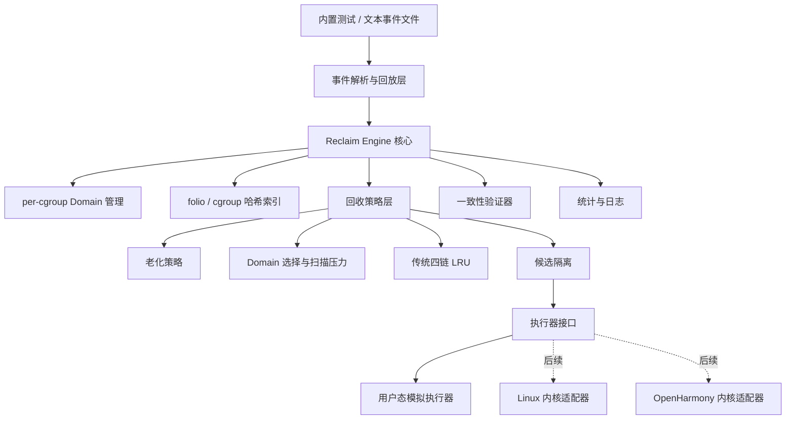

# 第一部分：总体架构



## 1. 输入与事件回放层

负责把两种输入转换成统一事件：
```text
内置C测试场景
文本trace文件
        ↓
struct reclaim_event
```

它只负责：
- 解析参数；
- 检查事件格式；
- 调用引擎公开接口；
- 记录事件序号和文件行号。
    

它**不负责**：

- 移动LRU；
- 计算扫描压力；
- 选择页面；
- 判断回收结果。

例如：
```text
PAGE_ADD 1001 1 FILE 0
PAGE_ACCESS 1001 2
AGE_GROUP 1
RECLAIM_GROUP 1 1
```

都会先转换为统一的 `reclaim_event`。

---

## 2. Reclaim Engine 核心
`reclaim_engine` 是整个系统的上下文对象：
```c
struct reclaim_engine {
    struct reclaim_platform platform;
    struct reclaim_engine_config config;

    struct reclaim_page_table page_table;
    struct reclaim_domain_table domain_table;

    const struct reclaim_aging_ops *aging_ops;
    const struct reclaim_domain_selector_ops *selector_ops;
    const struct reclaim_executor_ops *executor_ops;

    struct reclaim_engine_stats stats;
    uint64_t event_seq;
};
```

它负责协调各模块，但不把所有逻辑都堆在一个文件中。
例如：
```text
PAGE_ACCESS
→ engine查找folio
→ aging_ops处理访问

RECLAIM_ALL
→ selector_ops计算扫描压力
→ LRU模块隔离候选
→ executor_ops执行
→ 统计模块汇总结果
```
第一版：

- 单线程；
- 无全局可变状态；
- 每个引擎实例拥有独立配置和数据；
- 锁接口为空操作；
- 后续多线程时再替换锁实现。

---

## 3. Domain 与 per-cgroup LRU

每个 cgroup 对应一个 `reclaim_domain`：
```c
struct reclaim_domain {
    uint64_t cgroup_id;

    struct reclaim_lru_list inactive_anon;
    struct reclaim_lru_list active_anon;
    struct reclaim_lru_list inactive_file;
    struct reclaim_lru_list active_file;

    struct reclaim_domain_config config;
    struct reclaim_domain_stats stats;

    struct reclaim_domain *hash_next;
};
```

其职责是：
- 维护该 cgroup 的四条策略 LRU；
- 保存该 cgroup 的扫描配置；
- 保存folio数和基础页数统计；
- 为后续预测绑定应用、状态和提示。
    

这里的 LRU 是：

> **用户态第一版中的策略LRU，后续在只有全局LRU的OpenHarmony上可演化为shadow per-cgroup LRU。**

它不是用户态程序真正控制的内核物理页LRU。

---

## 4. Folio 元数据与哈希索引

一个 `reclaim_page` 表示一个不可拆分的folio：

```c
struct reclaim_page {
    uint64_t page_id;

    uint64_t charge_cgroup_id;
    uint64_t last_access_cgroup_id;

    enum reclaim_page_type type;
    enum reclaim_page_state state;
    enum reclaim_lru_kind lru_kind;

    uint32_t order;
    uint32_t flags;

    uint64_t last_access_seq;
    uint64_t last_age_seq;
    uint32_t access_count;

    bool referenced;
    bool shared;

    enum reclaim_sim_outcome next_sim_outcome;

    struct reclaim_list_node lru_node;
    struct reclaim_page *hash_next;
};
```

核心语义：

```text
page_id
→ 唯一定位folio

charge_cgroup_id
→ 决定folio归属于哪个cgroup及其LRU

last_access_cgroup_id
→ 记录最近观察到的访问者，仅用于预测

order
→ folio包含的基础页数为 1 << order
```

页面通过哈希表查询，通过内嵌链表节点挂入一条LRU。

---

## 5. 策略层

策略层拆成三个相互独立的接口。

### Aging Policy

处理：

```text
PAGE_ACCESS
AGE_GROUP
AGE_ALL
```

第一版为：

```text
G1：referenced置位 + 显式AGE
```

后续可以替换为：

```text
更接近Linux传统LRU的老化策略
MGLRU generation策略
```

### Domain Selector

处理全局回收：

```text
RECLAIM_ALL
→ 遍历哪些cgroup
→ 每个priority下扫描多少
```

第一版采用：

```text
K1-L：Linux式动态扫描压力基线
```

### LRU Scan Policy

负责：

```text
anon/file预算分配
inactive链扫描
候选folio隔离
批次大小限制
folio超额选择
```

第一版使用：

```text
swappiness静态权重
+
swap_enabled开关
+
scan_batch_pages
```

---

## 6. 执行器接口

统一接口概念为：

```c
struct reclaim_executor_ops {
    int (*execute_batch)(
        void *context,
        struct reclaim_candidate_batch *batch,
        struct reclaim_exec_result *result);
};
```

不同阶段注册不同实现：

```text
用户态
→ simulator_executor_ops

Linux验证阶段
→ linux_vmscan_executor_ops

OpenHarmony阶段
→ openharmony_reclaim_executor_ops
```

用户态模拟器：

- 默认成功；
    
- 支持单次失败注入；
    
- 不实现真实swap、writeback和unmap。
    

内核适配器：

- 调用内核已有隔离和回收机制；
    
- 收集真实批次统计；
    
- 不重新实现底层页面回收。
    

---

## 7. 一致性验证器

验证器独立于回收算法：

```c
int reclaim_engine_validate(
    const struct reclaim_engine *engine,
    struct reclaim_validation_report *report);
```

测试模式下：

```text
执行一个事件
→ validate
→ 再执行下一个事件
```

主要检查：

```text
哈希表状态
LRU挂链状态
生命周期状态
charge cgroup归属
anon/file类型
active/inactive类别
folio与基础页统计
隔离集合
全局统计守恒
```

这样发生链表损坏时，可以定位到具体事件，而不是测试结束后才发现。

---

## 8. 平台抽象层

平台差异通过实例级 `ops` 注入：

```c
struct reclaim_platform {
    const struct reclaim_allocator_ops *allocator;
    const struct reclaim_clock_ops *clock;
    const struct reclaim_log_ops *logger;
    const struct reclaim_lock_ops *locks;

    void *context;
};
```

第一版映射：

```text
allocator → malloc/calloc/free
clock     → 用户态单调时钟
logger    → stdout/stderr
locks     → 单线程空锁
```

后续替换为Linux或OpenHarmony对应接口，策略核心不直接依赖平台函数。

---

# 总体职责边界

|模块|核心职责|
|---|---|
|Event Parser|将文本转为统一事件|
|Engine|调度模块，不承载所有具体算法|
|Page Table|通过page ID定位folio|
|Domain Table|通过cgroup ID定位domain|
|Domain/LRU|维护每cgroup四条LRU|
|Aging Policy|处理访问和老化|
|Domain Selector|决定全局回收扫描压力|
|LRU Scanner|分配anon/file预算并隔离候选|
|Executor|执行模拟回收或连接真实内核|
|Validator|检查数据结构和统计一致性|
|Stats/Logger|输出扫描、隔离、回收和退出原因|

这一总体架构和职责划分是否确认？